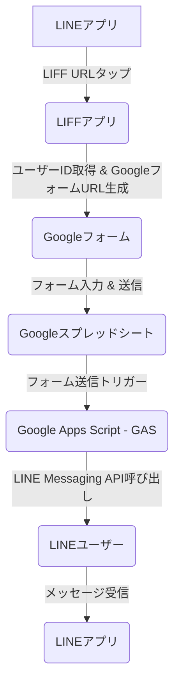

# LINEリマインド自動化システム レビュー依頼書

## 1. 概要

本システムは、LINE LIFFアプリ、Googleフォーム、Google Apps Script (GAS)、LINE Messaging APIを連携させ、ユーザーがGoogleフォームから「月1特別レッスン」に申し込んだ際に、自動的にLINEメッセージを送信する仕組みです。

## 2. システムアーキテクチャとデータフロー

### 2.1. 全体像

ユーザーがLINEアプリ内でLIFFアプリを起動し、そこからGoogleフォームへリダイレクトされます。Googleフォームで申し込みを完了すると、その情報がGASを介してLINE Messaging APIに渡され、ユーザーに確認メッセージが送信されます。

### 2.2. 各コンポーネントの役割

*   **LINE LIFFアプリ (`liff_app.html`)**:
    *   LINEアプリ内で動作するWebアプリ。
    *   ユーザーのLINE IDトークンを取得し、そこからユーザーIDを抽出。
    *   抽出したユーザーIDをGoogleフォームのURLに埋め込み、ユーザーをGoogleフォームへリダイレクトする。
    *   **ファイル**: `/Users/kentaro/Documents/ObsidianVault/10_Projects/03_PROGRAMEGG連絡体制改善/01_リマインド自動化ソリューション評価/liff_app.html`

*   **Googleフォーム**:
    *   ユーザーが「月1特別レッスン」への参加希望などの情報を入力するインターフェース。
    *   LIFFアプリから渡されたLINE User IDを自動的に受け取る隠しフィールド (`LINEUserID`) を持つ。
    *   フォームの回答は自動的にGoogleスプレッドシートに記録される。

*   **Googleスプレッドシート (`PROGRAM_EGG_マスター`)**:
    *   Googleフォームからの回答（タイムスタンプ、参加希望レッスン、氏名、LINE User IDなど）を記録・管理するデータストア。
    *   **ファイル**: `PROGRAM_EGG_マスター` (Google Drive上)

*   **Google Apps Script (GAS) (`Code.gs`)**:
    *   Googleフォームの送信をトリガーとして自動実行されるバックエンドロジック。
    *   フォームの回答からLINE User IDと申込内容を抽出し、条件（例: 「月1特別レッスン」に申し込んだ場合）に応じてLINE Messaging APIを呼び出す。
    *   **ファイル**: `Code.gs` (GASプロジェクト内)
    *   **ローカルコピー**: `/Users/kentaro/Documents/ObsidianVault/10_Projects/03_PROGRAMEGG連絡体制改善/01_リマインド自動化ソリューション評価/gas_onFormSubmit_debug_script.js`

*   **LINE Messaging API**:
    *   GASからの指示に基づき、特定のLINEユーザーID宛にメッセージをプッシュ送信する。

## 3. 設定と実装の詳細

### 3.1. LINE Developers設定

*   **プロバイダー名**: `EGG`
*   **Messaging APIチャネル**: `リマインド通知` (チャネルアクセストークンはGASのスクリプトプロパティに設定済み)
*   **LINEログインチャネル**: `申込受付` (LIFF IDは `liff_app.html` に設定済み)
    *   LIFFアプリのエンドポイントURLはGitHub Pagesで公開された `liff_app.html` のURLに設定済み。

### 3.2. Google Apps Script (GAS) 設定

*   **プロジェクト名**: `リマインド自動化スクリプト` (推奨)
*   **スクリプトプロパティ**:
    *   `LINE_CHANNEL_ACCESS_TOKEN`
    *   `LINE_LOGIN_CHANNEL_ID`
*   **トリガー**: `onFormSubmit` 関数が「スプレッドシートから」「フォーム送信時」に実行されるように設定済み。

### 3.3. Googleフォーム設定

*   **フォームタイトル**: 「月1特別レッスン 申込フォーム」など
*   **質問項目**: 「LINEUserID」（記述式、隠しフィールドとして利用）を含む。
*   **回答先**: `PROGRAM_EGG_マスター` スプレッドシートの新しいシート（例: 「フォームの回答 1」）。

## 4. テスト方法

1.  **LIFF URLにアクセス**: LINEアプリから、LINE Developersコンソールで確認できるLIFFアプリのURL (`line://app/...`) をタップします。
2.  **Googleフォームへリダイレクト**: LIFFアプリが起動し、自動的にGoogleフォームへリダイレクトされることを確認します。この際、「LINEUserID」の項目に自身のLINEユーザーIDが自動入力されていることを確認します。
3.  **フォームを送信**: Googleフォームの必要な項目を入力し、「送信」ボタンをクリックします。
4.  **LINEメッセージの確認**: フォーム送信後、自身のLINEアカウントに「月1特別レッスンへのお申し込みありがとうございます！」というメッセージが届くことを確認します。
5.  **スプレッドシートの確認**: `PROGRAM_EGG_マスター` スプレッドシートの「フォームの回答 1」シートに、送信したフォームの回答とLINE User IDが記録されていることを確認します。

## 5. 今後の展望

*   リマインドメッセージの送信タイミングの制御（例: レッスン前日に自動送信）。
*   リッチメニューやFlex Messageなど、よりリッチなLINEメッセージの活用。
*   申込内容に応じたメッセージの出し分け。

## 6. 関連ファイル

*   `LINE_Remind_Automation_Project_Overview.md`: プロジェクト計画書
*   `TODO.md`: 開発タスクリスト
*   `LINE_Developers_Setup.md`: LINE Developers設定手順
*   `GAS_Secrets_Management.md`: GASでの機密情報管理ガイド
*   `GAS_Deploy_Guide.md`: GAS Webアプリのデプロイ手順
*   `Google_Form_Setup_Guide.md`: Googleフォームセットアップガイド
*   `GitHub_Pages_Guide.md`: GitHub Pages利用ガイド
*   `liff_app.html`: LIFFアプリのHTML/JavaScriptコード
*   `gas_onFormSubmit_debug_script.js`: GASの`Code.gs`のローカルコピー