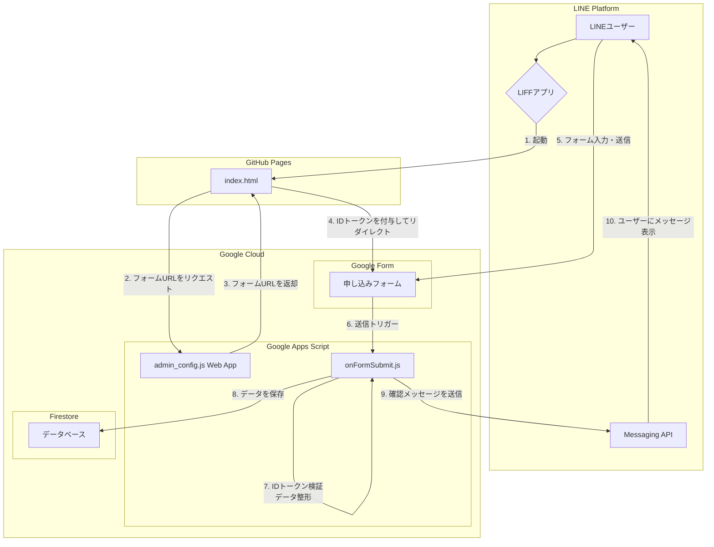

# システム設計仕様書

## 1. 概要

本システムは、LINE上で動作するLIFFアプリを通じて、ユーザー情報と申し込み内容を収集し、Firestoreに安全に保存することを目的としたシステムである。ユーザーはLINEアプリからシームレスに申し込みフォームにアクセスし、入力を行うことができる。

## 2. システム構成図

## 3. コンポーネント詳細

### 3.1. LIFF (Frontend)

-   **ファイル**: `index.html`
-   **ホスティング**: GitHub Pages
-   **役割**:
    1.  **ユーザー認証**: LIFF SDKを通じてLINEユーザーの認証を行い、IDトークンを取得する。
    2.  **動的URL取得**: `admin_config.js`で作成されたGAS Web Appにアクセスし、現在有効なGoogleフォームのURLを取得する。
    3.  **リダイレクト**: 取得したGoogleフォームのURLに、ユーザーのIDトークンをクエリパラメータとして付与し、ユーザーをリダイレクトさせる。

### 3.2. Google Apps Script (Backend)

#### 3.2.1. 管理UI & API (`admin_config.js`)

-   **デプロイ形式**: Webアプリケーション
-   **役割**:
    1.  **フォームURL設定UI**: 管理者がブラウザ経由でアクセスし、リダイレクト先となるGoogleフォームのURLを設定・保存するためのWeb UIを提供する。
    2.  **フォームURL提供API**: LIFFアプリ (`index.html`) から `?action=getGoogleFormUrl` というパラメータ付きでGETリクエストを受け取ると、スクリプトプロパティに保存されているGoogleフォームのURLをテキスト形式で返す。

#### 3.2.2. フォーム送信時処理 (`onFormSubmit.js`)

-   **トリガー**: Googleフォームの「フォーム送信時」イベント
-   **役割**:
    1.  **IDトークン検証**: フォームから受け取ったIDトークンをLINEのAPIエンドポイントに送信し、正当性を検証する。これにより、なりすましを防ぎ、信頼できるLINEユーザーからの送信であることを確認する。
    2.  **ユーザーID特定**: 検証済みのIDトークンからLINEユーザーIDを抽出する。
    3.  **データ保存**: フォームの回答内容とLINEユーザーIDを紐づけて、Firestoreデータベースに保存する。
    4.  **確認メッセージ送信**: 処理が正常に完了したことをユーザーに通知するため、LINE Messaging APIを通じてサンキューメッセージを送信する。

### 3.3. Googleフォーム

-   **役割**:
    1.  **ユーザー入力インターフェース**: ユーザーが申し込み情報を入力するためのフォーム。
    2.  **IDトークン受け取り**: LIFFアプリから渡されるIDトークンを受け取るための非表示フィールドを持つ。
    3.  **GASトリガー**: フォームが送信されると、`onFormSubmit.js`の実行をトリガーする。

### 3.4. Firestore

-   **役割**:
    -   **データストレージ**: ユーザーから送信された申し込み情報を永続的に保存するNoSQLデータベース。LINEユーザーIDとフォームの回答がセットで記録される。

## 4. 処理・データフロー

1.  ユーザーがLINEアプリでLIFF URLをタップする。
2.  GitHub Pages上の`index.html`が読み込まれ、LIFF SDKが初期化される。
3.  `index.html`はGAS Web App (`admin_config.js`) に問い合わせ、リダイレクト先のGoogleフォームURLを取得する。
4.  `index.html`は取得したフォームURLの末尾に、LIFF SDKで取得したIDトークンを付与して、そのURLにユーザーをリダイレクトする。
5.  ユーザーはGoogleフォームに情報を入力し、送信する。
6.  フォームの送信をトリガーに`onFormSubmit.js`が実行される。
7.  `onFormSubmit.js`は、フォーム経由で受け取ったIDトークンをLINEのAPIで検証し、ユーザーIDを取得する。
8.  `onFormSubmit.js`は、フォームの回答データとユーザーIDをFirestoreに書き込む。
9.  `onFormSubmit.js`は、LINE Messaging APIを利用して、申し込み完了のメッセージをユーザーに送信する。 